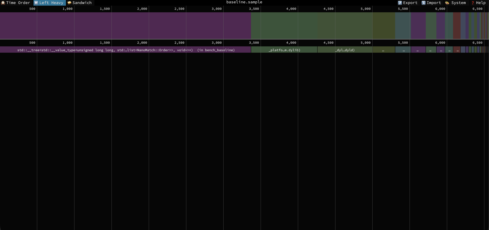
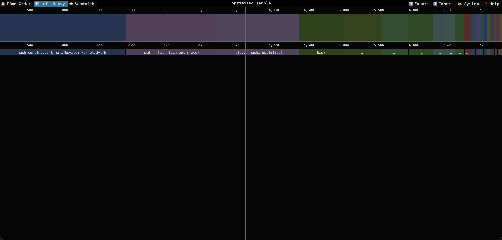

# NanoMatch: Ultra-Low Latency Order Matching Engine

NanoMatch is a high-performance Limit Order Book (LOB) built in C++20, designed for sub-microsecond execution. It prioritizes **Hardware Sympathy** — aligning software architecture with CPU cache hierarchies and memory management behaviors to achieve deterministic, ultra-low latency.

---

## Performance Snapshot

| Metric           | STL Baseline | NanoMatch Optimized | Improvement                 |
| ---------------- | ------------ | ------------------- | --------------------------- |
| P50 Latency      | 41ns         | 41ns                | Deterministic               |
| P99 Latency      | 666ns        | 83ns                | **8.0x faster**             |
| Page Faults      | 1,816,101    | 723,264             | 60.2% reduction             |
| Context Switches | 30,020       | 1,177               | 96.1% reduction             |
| System Time      | 3.11s        | 2.36s               | 24.1% lower kernel overhead |
| Throughput       | —            | ~7M+ orders/sec     | —                           |

---

## Architectural Core

### 1. Zero-Allocation Hot Path

Dynamic memory allocation (`malloc`/`new`) is a latency killer due to non-deterministic syscalls and heap fragmentation. NanoMatch uses a **pre-allocated Memory Pool** for all `Order` objects.

- **Complexity:** O(1) allocation/deallocation via a lock-free free list.
- **Impact:** Zero heap churn during active matching.

### 2. Cache-Optimized Data Structures

- **Intrusive Doubly-Linked Lists:** Orders at each price level are stored in an intrusive list, allowing O(1) cancellation and fill-removal without extra pointer chasing or container overhead.
- **Struct Packing:** The `Order` struct is packed using `#pragma pack(1)` to fit as much data as possible into a single 64-byte L1 cache line.
- **Flat Price Levels:** Bid and Ask levels are stored in sorted contiguous vectors, making Best Bid/Offer (BBO) lookups extremely cache-friendly.

### 3. Lock-Free Trade Logging

Trades are offloaded via a **Single-Producer Single-Consumer (SPSC) Ring Buffer** to prevent I/O from blocking the matching engine.

- **False Sharing Prevention:** Uses `alignas(64)` to ensure head and tail pointers reside on separate cache lines.
- **Memory Ordering:** Uses `std::memory_order_acquire/release` semantics for efficient thread synchronization without mutexes.

### 4. Zero-Copy Ingestion

- **ITCH 5.0 Parser:** Uses `mmap` to map binary market data files directly into the process address space, parsing data in-place without copying into intermediate buffers.
- **Branch Prediction:** Critical paths use `[[likely]]` and `[[unlikely]]` hints to guide the CPU's branch predictor and minimize pipeline stalls.

---

## Build and Run

### Prerequisites

- CMake 3.15+
- Clang/LLVM (C++20 support)

### Compilation

```bash
mkdir build && cd build
cmake -DCMAKE_BUILD_TYPE=Release ..
make -j
```

### Benchmarking

```bash
./bench_latencies
```

---

## Visual Profiling Evidence

Profiled on macOS Apple Silicon using `sample` + [speedscope](https://speedscope.app) flame graphs. Two separate binaries were compiled and profiled independently:

- `bench_baseline` — STL implementation (`std::map`, `std::list`)
- `bench_optimized` — NanoMatch memory pool + contiguous arrays

### Flame Graph: STL Baseline



`std::__tree<...NanoMatch::Order...>` dominates ~53% of execution time — direct evidence of STL map tree traversal and pointer-chasing cache misses.

### Flame Graph: NanoMatch Optimized



Tree operations are gone. Execution is flat hash-based lookup with `mach_continuous_time` dominating — zero allocation overhead.

---

## Hardware Note

> Profiled on macOS Apple Silicon (M-series). Docker virtualization does not expose PMU hardware
> counters to Linux guests, so `L1-dcache-load-misses` via `perf stat` were unavailable.
> Cache efficiency is demonstrated through flame graph call stack analysis and proxy metrics
> (page faults, context switches, P99 latency distribution).

---
